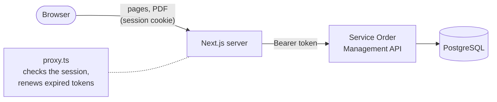

# Service Order Dashboard

[](https://github.com/otaldoneto/service-order-dashboard/actions/workflows/ci.yml)

Read-only dashboard for the [Service Order Management API](https://github.com/otaldoneto/Project-Help-Desk), built
with Next.js. Browse service orders with filters, open any order and download its PDF report.

**Live demo:** https://service-order-dashboard.vercel.app (click **Enter as demo**)

The API runs on Render's free plan and sleeps after 15 minutes without traffic, so the first request can take about a
minute while it wakes up. The dashboard says so on screen instead of hanging.

## Features

- **One-click demo access** with a read-only account (`VIEWER` role): visitors can look at everything and change nothing
- **Service order list** with filters by status, priority and title, and pagination
- **Filters kept in the URL** (`/?status=OPEN&page=2`): filtered views can be bookmarked and shared, and the browser's
  back button works between them
- **Order details** with client, technician, dates, description and root cause report
- **PDF report download**, proxied through the dashboard's own server
- **Loading and error screens** made for a slow, sleeping API, with a **Try again** button
- Responsive layout and dark mode

## How it works

The browser never talks to the API. The Next.js server sits in between (the *Backend for Frontend* pattern): it logs
in, keeps the API tokens in `httpOnly` cookies and makes every API call itself.



1. **Enter as demo** runs a Server Action that logs in to the API with the demo credentials stored in the server's
   environment variables. The access token (15 minutes) and the refresh token (7 days) are stored in `httpOnly`,
   `Secure`, `SameSite=Lax` cookies.
2. Before every page, `proxy.ts` sends visitors without a session to the login page and, when the access token has
   expired, exchanges the refresh token for a new pair so the visitor never notices.
3. Pages are Server Components: they read the token from the cookie and call the API directly on the server.
4. The PDF link points to a Route Handler that fetches the report from the API and streams it to the browser.
5. **Sign out** revokes the refresh token on the API and deletes the cookies.

## Tech stack

- Next.js 16 (App Router, Server Components, Server Actions, Route Handlers, `proxy.ts`)
- React 19 and TypeScript
- Tailwind CSS 4
- Vitest
- GitHub Actions and Vercel

## Getting started

Requirements: Node.js 24.

```bash
git clone https://github.com/otaldoneto/service-order-dashboard.git
cd service-order-dashboard
npm install
cp .env.example .env.local
```

Fill in `.env.local`:

| Variable | Description |
|---|---|
| `API_BASE_URL` | Base URL of the Service Order Management API |
| `DEMO_EMAIL`, `DEMO_PASSWORD` | A `VIEWER` account of that API, used by the **Enter as demo** button |

All three are read on the server only (no `NEXT_PUBLIC_` prefix), so they never reach the browser. To create a
`VIEWER` account, log in to the API as `ADMIN` and call `POST /users` with `"role": "VIEWER"`.

Then run the dashboard on http://localhost:3000:

```bash
npm run dev
```

## Scripts

| Command | What it does |
|---|---|
| `npm run dev` | Development server |
| `npm run build` | Production build |
| `npm run lint` | ESLint |
| `npm run typecheck` | Generates the route types and runs the TypeScript compiler |
| `npm test` | Unit tests (Vitest) |

The CI runs lint, type check, tests and build on every push and pull request.

## Design decisions

- **Backend for Frontend with `httpOnly` cookies.** Tokens never reach page JavaScript, so a script injected into the
  page (XSS) cannot steal them, and the API needs no CORS configuration.
- **Only a demo button, no login form.** The API limits failed logins to 5 per IP address every 15 minutes. With a
  BFF, every visitor reaches the API from the host's IP addresses, so a few wrong passwords typed by one visitor would
  lock the demo out for everyone. The button always sends the right credentials, so it never counts as a failure.
- **Filters live in the URL.** The page is a Server Component that reads them from `searchParams`: no client state,
  and invalid values in a hand-edited URL are dropped instead of being sent to the API.
- **One API client for the whole app** (`src/lib/api/client.ts`), marked `server-only` so a build fails if it is ever
  imported into browser code. It never caches responses, waits up to 90 seconds for a sleeping API and turns failures
  into typed errors (`ApiError`, `ApiUnavailableError`) that each screen handles on its own terms.
- **Staff e-mails are never shown.** The API returns who created and last changed each order, and those fields hold
  staff logins, including the administrator's. A public demo does not display them.
- **The PDF request accepts JSON as well.** Errors from the API are JSON; asking for `application/pdf` only would turn
  the API's 404 for a missing order into a server error.

## Known limitations

- **Cold starts.** The first request after the API has been idle can take about a minute, a limit of Render's free
  plan. The dashboard shows a loading screen and a clear error with a retry button if the API does not answer within
  90 seconds.
- **"Not found" pages answer with HTTP 200.** The loading screen is streamed before the API replies, and the status
  code cannot change afterwards. Next.js marks those pages `noindex`, and the visitor still sees the right message.
- **Read-only.** Creating and updating orders is available in the API (Swagger UI), not in this dashboard.

## Related project

The API behind this dashboard, with authentication, roles, the PDF report and its own tests and CI:
[Service Order Management API](https://github.com/otaldoneto/Project-Help-Desk).

## License

[MIT](LICENSE)
